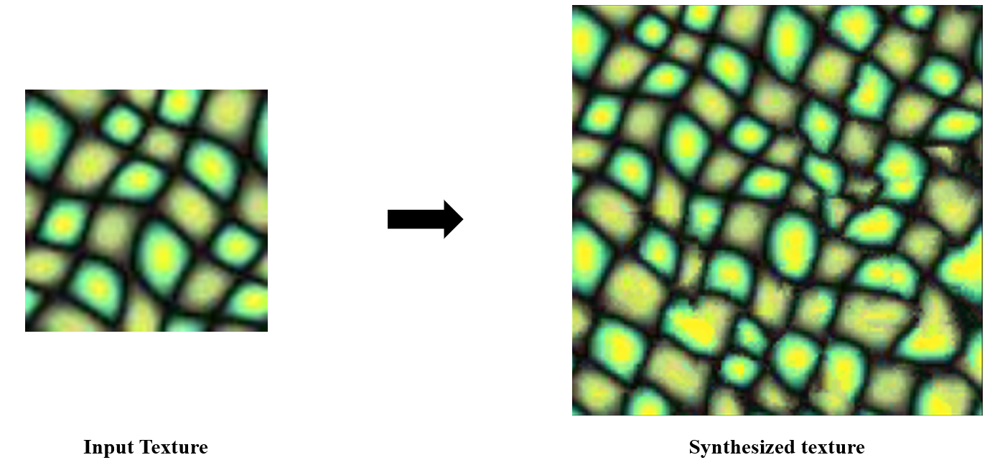
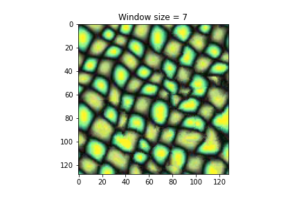
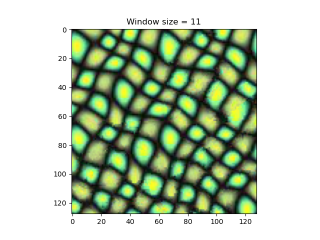
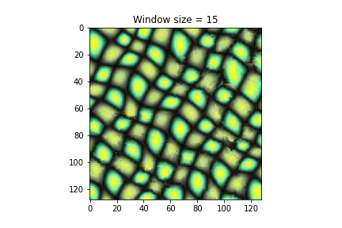
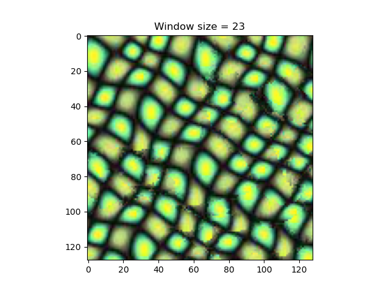
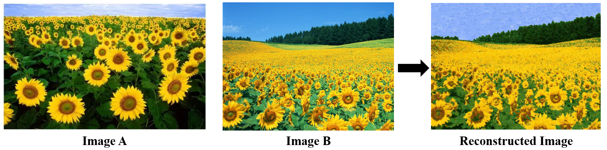
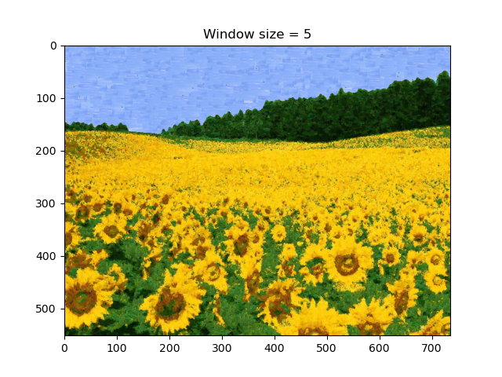

# TextureSynthesis

- python == 3.8.8
- numpy == 1.20.1
- matplotlib == 3.3.4

# pixel_match.py 

The following figures show four different results when using a window size of 7, 11, 15, and 23, respectively.

     

# patch_match.py

The following figures show four different results when using a window size of 5, 7, 9, and 15, respectively.

     

# References:
[1] Texture synthesis by non-parametric sampling: https://www2.eecs.berkeley.edu/Research/Projects/CS/vision/papers/efros-iccv99.pdf  
[2] Image Quilting for Texture Synthesis and Transfer: https://people.eecs.berkeley.edu/~efros/research/quilting/quilting.pdf
